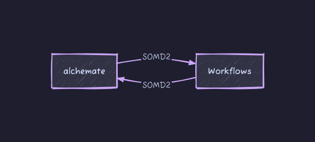

# alchemate



[](https://github.com/akalpokas/alchemate/actions/workflows/ci.yml)
[](https://www.gnu.org/licenses/gpl-3.0)

Modular [SOMD2](https://github.com/OpenBioSim/somd2) processing workflows.

## Purpose
Alchemate implements and abstracts high-level functionality to SOMD2 FEP engine, such as iterative λ-schedule optimization or convergence detection for example. The framework is designed to be modular and extensible which allows for arbitrary workflows to be written and plugged in easily.

## Usage
Using alchemate involves creating a SOMD2 configuration object, defining a simulation workflow, and creating a manager which will run the specified workflows sequentially:

```python
from somd2.config import Config as somd2_config
from alchemate.manager import WorkflowManager
from alchemate.context import SimulationContext

# Import the modular workflows you need for the calculation
from alchemate.steps.base import RunBasicCalculation
from alchemate.steps.postprocessing import OptimizeConvergence

# Define SOMD2 configuration for setting up the physical simultion (electrostatics, cutoff, timestep, etc.)
somd2_config = somd2_config()
somd2_config.cutoff_type = "RF"
somd2_config.cutoff = "12A"
somd2_config.replica_exchange = True

# Create the context that keeps track of data
context = SimulationContext(system="merged_molecule.s3", somd2_config=somd2_config)

# Define the desired workflow
simulation_workflow = [
    RunBasicCalculation(),
    OptimizeConvergence(optimization_threshold=0.1) # Customize the workflow if needed
]

# Create the manager with this workflow
manager = WorkflowManager(context=context, workflow_steps=simulation_workflow)

# Run everything, manager will keep track of workflow steps that are completed
final_context = manager.execute()
```

At the heart of alchemate is the `SimulationContext` class which gets passed through workflows sequentially and updated with new information. This can for example, be used to attempt and pre-optimize the λ-schedule of a transformation in vacuum, before using the updated context in the main simulation:

```python
simulation_workflow = [
    OptimizeExchangeProbabilities(optimization_attempts=3),
    RunBasicCalculation()
]
```

Or a further post-processing workflow can be plugged in to test for simulation convergence:

```python
simulation_workflow = [
    RunBasicCalculation(),
    OptimizeConvergence(optimization_threshold=0.1)
]
```

In general, workflows are divided into 3 different categories based on the data that the context is supposed to hold at that point:
1. **Pre-processing:**
    - Simulation data is not expected.
    - Workflows here perform actions to augment the base workflow.
2. **Base:**
    - Simulation data not is expected, but will be used if present.
    - Workflows here establish basic simulation data.
3. **Post-processing:**
    - Previous simulation data is expected.
    - Workflows here perform actions on finished simulations and extend them if needed.

Head to [examples](examples/) for more detailed scripts.
___
## Installation

### General use
To install alchemate, please install [SOMD2](https://github.com/OpenBioSim/somd2) into your conda environment first. Then you can install alchemate into your environment by cloning this repository, and running:
```bash
pip install -e .
```

### Developing and contributing

Developer dependencies can be installed with:
```bash
pip install -e '.[dev]'
```

and activating commit hooks:
```bash
pre-commit install
```

Testing is done using:
```bash
python -m pytest -svvv --color=yes tests
```

#### Adding new workflow steps

Every workflow step in alchemate is derived from the `WorkflowStep` [template class](src/alchemate/steps/base.py). The template class ensures that each derived class will be provided a `SimulationContext` class during the run time. Upon the step completion, the `WorkflowManager` will record the name of the step in `SimulationContext.completed_steps`, which allows it to keep track of what has been previously run (for example, if restarting the full workflow). Each derived `WorkflowStep` class needs to implement a valid `_execute()` method in order to be used in a workflow.

For example to create a basic dummy class:

```python
    class DummyClass(WorkflowStep):
        """
        Some docs...
        """

        def __init__(
            self,
            some_parameter: int = 3
        ) -> None:
            super().__init__()
            self.some_parameter = some_parameter

        def _execute(self, context: SimulationContext):
            # Access and modify context here!
```
